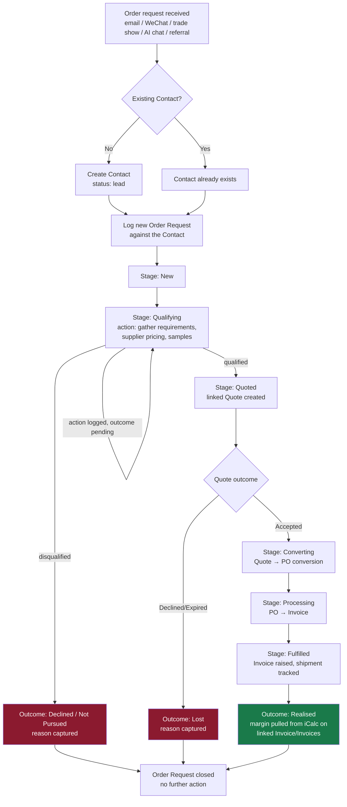

# REQ-ORD-001 — Order Request Tracking & Action Pipeline (Enquiry → Realised Margin)

**Status:** Draft v1 — not yet submitted to requirements-gate
**Version:** 1
**Date:** 2026-07-11
**Author:** FPM International / Claude Code
**Related:** Contacts (v2.9.27), Quote Engine (v2.9.4), Buyers (v2.9.37), REQ-DATA-001-v5/SPEC-DATA-001-v6 (`num` reference numbers), CON-GAP-004, CON-GAP-005

---

## 1. Business Context

Order requests currently arrive from disparate sources — email, WeChat, trade show conversations, referrals, the in-app AI chat — and today land in Stackd Ops in one of two disconnected places:

- **Contacts** (`DB.con`): a lead/pipeline entity with `status` (`lead` → `qualified` → `converted` → `closed`), an append-only `enquiries[]` log (free-text summary + timestamp + source), and a one-way "→ Quote" action that pre-populates a new Quote from the contact's name/email.
- **Quotes** (`DB.qt`): once a Quote exists, it carries `sourceContactId` back to the originating Contact, and `linkedPOId` forward to a converted Purchase Order — but a Contact can only ever be linked *from* one Quote's perspective at creation time; there's no reverse view of "show me every live order request this contact currently has open."

**The core gap:** none of `enquiries[]`, `status`, or the Quote/PO/Invoice chain constitutes a genuine **order request** as its own trackable unit. Concretely, verified against the live code:

1. **One contact, one status — but potentially many concurrent requests.** `saveCon()` (`index.html:8624`) stores a single `status` field per Contact record. A company that has two live, simultaneously-in-progress order enquiries (e.g. a repeat buyer asking about a second product line while their first order is still mid-quote) has no way to represent that in the data model — `status` can only describe one thing at a time. The `enquiries[]` array (`index.html:8611`) logs *that* a conversation happened, with a free-text summary, but is a flat history log, not a set of trackable, independently-stageable work items.
2. **No action/outcome tracking between enquiry and quote.** Between "a contact enquired" and "a quote exists," there is no structured place to record next-step actions (e.g. "awaiting supplier pricing," "sent samples," "following up Friday") or outcomes (e.g. "declined — price," "lost to competitor," "converted"). This currently lives only in the free-text `enquiries[].summary` field and the operator's own memory.
3. **No aggregate view from request to realised margin.** The chain Contact → Quote → PO → Invoice already exists structurally (`sourceContactId`, `linkedPOId`, and PO→Invoice linkage via `invId`/`invNum`), and realised margin per invoice is already calculated (`iCalc(inv).gp` / `.np`, `index.html:3166`) — but there is no single view that starts from "here are all open order requests and where each one is stuck" and ends at "here is the realised margin this request actually produced," across however many Quote revisions or partial conversions happened along the way. Today, answering "what did that enquiry from three months ago actually turn into, and was it profitable?" requires manually tracing `sourceContactId` → Quote → `linkedPOId` → PO → Invoice by hand.
4. **Nothing prompts follow-up.** There is no due-date or reminder concept anywhere in the Contact/Quote pipeline today. A qualified lead with no activity for weeks looks identical in the list view to one with an action due tomorrow, other than the existing `>700 day` stale-contact flag (`CON-GAP-001`), which is far too coarse a horizon for active order chasing.

This was raised as a business need directly (not sourced from an existing gap ID) during a review of how order intake, qualification, and progress-to-invoice should work as FPM's trade volume grows past a small number of concurrent relationships being tracked from memory.

## 2. Stakeholders

| Role | Party | Need |
|---|---|---|
| Operator | FPM International (sole trader) | See every live order request, its current stage, what action is next, and who owns it — across all sources, in one place |
| Operator (retrospective) | FPM International | Trace any historical order request through to its realised margin outcome, to learn which enquiry sources/products/buyers are actually profitable |
| AI Assistant | Built-in Stackd Ops AI | Answer "what order requests are open / stuck / overdue for action" from live data, and (later, out of scope here) help draft follow-ups |
| Future migration | v3.0.0 Supabase cutover (FM-1) | A data model for order requests that's additive to the existing Contact/Quote/PO/Invoice chain, not a parallel entity that has to be reconciled with it later |

## 3. Draft Workflow (for discussion before formal scoping)

This is a first pass at the lifecycle this requirement needs to support — intentionally drawn before Acceptance Criteria are finalized, so the workflow itself can be corrected first.

**Key design questions this draft raises, to settle before writing Acceptance Criteria:**

1. **New entity vs. sub-record on Contact?** Should "Order Request" be its own top-level `DB` entity (own `K`/store key, own `num` prefix e.g. `ORD-0001`) with a `contactId` FK, or an array field nested inside each Contact record (`con.orders[]`)? A top-level entity supports one contact having many concurrent, independently-stageable requests cleanly and is consistent with how Quotes/POs/Invoices are already modeled (each a top-level entity linked by ID) — but it's a heavier build. A nested array is lighter to build but re-creates the same "one flat array, no independent list/filter/search" limitation `enquiries[]` already has.
2. **How many stages, and are they enforced or advisory?** The draft above uses New → Qualifying → Quoted → Converting → Processing → Fulfilled, mirroring the existing Contact status vocabulary plus the natural Quote/PO/Invoice progression. Should stage transitions be system-enforced (like Quote's "Convert to PO only from Accepted," QTE-GAP-001) or freely settable by the operator?
3. **Action tracking — how structured?** A single free-text "next action" note field is a small addition; a full action list with due-dates, an owner field (moot for a sole trader, but future-proofs multi-operator use), and completion tracking is a bigger build. Given FM-1 caps new localStorage-stack complexity, the smallest workable version should be scoped first.
4. **Realised margin rollup — one Quote per Order Request, or many?** A single order request could, in principle, spawn revised quotes (already supported by Quote's own price-versioning) or even split across multiple invoices/shipments. The margin rollup needs a defined aggregation rule for the "many" case, not just the common one-to-one case.
5. **Retrofitting existing Contacts/Quotes.** Every Contact and Quote created before this ships has no Order Request records. Does the feature backfill one Order Request per existing Contact (lossy — collapses any prior multi-enquiry history in `enquiries[]` into one record), backfill one per existing Quote (more accurate, but only covers contacts that got as far as a Quote), or start clean going forward with historical data left in its current, less-structured form?

## 4. Scope (draft — to be finalized after workflow discussion)

### Likely in scope
- A structured way to track one or more concurrent order requests per Contact, each independently stageable
- A "next action" / follow-up field per order request, visible in a list view sorted by what's due/overdue
- An outcome field (won/lost/declined, with reason) recorded at the point an order request closes
- A rollup view/field showing realised margin (from `iCalc()`) for order requests that reached Invoice
- `num`-style reference numbering for the new entity if it is a top-level entity (consistent with SPEC-DATA-001)

### Likely out of scope (v1 — proposed, to confirm)
- Automated reminders/notifications (no scheduling mechanism exists in this local-only app; a "due date" field can exist without a notification system attached to it)
- AI-driven action suggestions or auto-drafted follow-ups (a natural v2 once the underlying data exists)
- Multi-operator ownership/assignment (FPM is currently a sole trader; the field can be reserved but not built out)
- Any change to Google Sheets sync mapping, pending the same FM-1 / fragile-sync caution already applied to `num` (see SPEC-DATA-001 §6, DATA-GAP-003)

## 5. FM-1 Compliance (preliminary)

If Order Request becomes a new top-level entity, this is **new entity, new complexity** on the localStorage stack — squarely the kind of change FM-1 asks to be scrutinized, not an automatic "new field on an existing entity" exception like `num` was. This requirement should explicitly justify why it's still worth doing on v2.9.x rather than deferring to v3.0.0, or scope a materially smaller version that qualifies as an FM-1-exempt extension of the existing Contact entity instead. This tension should be resolved explicitly in requirements-gate, not assumed either way here.

## 6. Open Risks / Questions for requirements-gate

- Whether a new entity is justified under FM-1 now, or should wait for v3.0.0 (§5)
- Backfill strategy for existing Contacts/Quotes with no Order Request history (§3, point 5)
- Whether stage transitions need hard enforcement or are operator-editable free text, given the operational cost of past over-engineering seen elsewhere in this codebase (e.g. QTE-GAP-001 needed a hard guard after a soft one wasn't enough)
- GDPR: an Order Request record would carry the same or greater PII exposure as `enquiries[]` today (contact identity, commercial terms, outcome/reason text) — needs its own explicit basis statement, not an inherited assumption from Contacts' existing GDPR card

## 7. Changelog

**v1 (this version):** Initial draft, written to capture the business need and a candidate workflow for discussion before Acceptance Criteria are finalized. Not yet submitted to requirements-gate.
