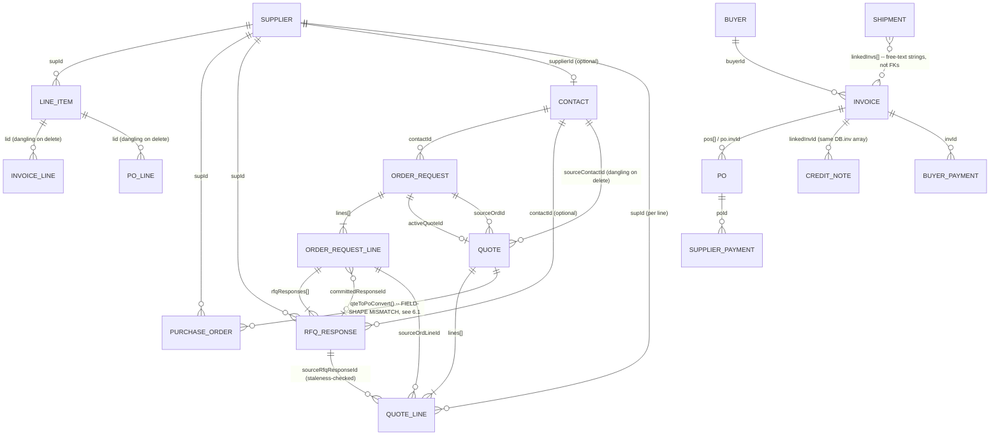

# Architecture & Data-Model Reference — v1

**Status:** Reference document, not a REQ. Produced by direct codebase research (four parallel research passes covering Master Data, Deal Pipeline, Fulfillment & Financial, and Cross-Cutting Infrastructure), verified against `main` @ v2.9.71 (681/681 tests).

**Purpose:** a single map of every entity/tab in the app, how they relate, and every data-management process that touches them — written as the foundation for scoping the cross-platform shared-backend migration (the app is currently localStorage-per-device with a manual/triggered Google Sheets sync; see §7 for why that's the actual problem this migration needs to solve).

**How to use this doc:** §2 is the fast-lookup entity table. §3 is the ER diagram. §4 is the full per-entity detail (schema, FKs, delete behavior, data-entry paths, sync footprint, gaps). §5 covers the systems that cut across every entity (state model, sync, Cloud Data precedent, CSV import, ref-numbers, integrity tooling, staleness detection, logging, FX, AI, backup). §6 lists newly-surfaced findings not yet in `docs/known-gaps.md`. §7 reproduces the accepted architectural risk this migration exists to close. §8 is the synthesis and sequencing recommendation.

---

## 1. Top-level state

Everything lives in one global `DB` object, persisted as 12 separate localStorage keys (`index.html:2692,2705`):

```
DB = { sup, li, inv, po, payments, sh, qt, con, events, buy, ord, supPayments }
```

Two things are not obvious from that list:
- **Credit Notes are not a separate array.** They live inside `DB.inv` with `type: 'credit_note'|'goodwill_credit'`.
- **RFQ Responses are not a separate array either.** They live nested three levels deep: `DB.ord[].lines[].rfqResponses[]`.

Both are treated as their own logical entities below because they carry their own ids, their own relationships, and their own (frequently absent) logging/sync behavior — but any migration plan needs to know they don't correspond 1:1 to a `DB` key.

Adding any new top-level entity today means manually touching seven separate places (`K`, `DB`, `EI`, `saveAll()`, the `showV*` render functions, `expAll()`'s snapshot, `doImport()`'s entity list — `CLAUDE.md:101`) — there is no single source of truth an entity is declared once against.

---

## 2. Entity inventory

| Entity | DB key | Ref-number | Backfilled? | Sheets sync | Cloud Data (Supabase) | CSV import | AI create |
|---|---|---|---|---|---|---|---|
| Supplier | `DB.sup` | `SUP-####` | ✓ | ✓ (push always; pull off once Cloud Data on) | **✓ in scope** | ✓ | ✓ |
| Line Item | `DB.li` | `LI-####` | ✓ | ✓ (pull off once its own Cloud Data migration is complete) | **✓ in scope (REQ/SPEC-CLOUD-002)** | ✓ | ✓ |
| Buyer | `DB.buy` | `BUY-####` | ✓ | **✗ none** | **✓ in scope** | **✗ none** | ✓ |
| Contact | `DB.con` | `CON-####` | ✓ | ✓ (**delete never propagated**; pull off once its own Cloud Data migration is complete) | **✓ in scope (REQ/SPEC-CLOUD-002)** | ✓ | ✓ (no read tool) |
| Order Request | `DB.ord` | `ORD-####` | ✓ | **✗ none** | out of scope | ✓ (webform shape only) | ✗ (write-only `update_order_line`) |
| Order Request Line | nested in `ord.lines[]` | — | n/a | none (parent has none) | out of scope | ✓ (via parent) | ✗ |
| RFQ Response | nested in `ord.lines[].rfqResponses[]` | — | n/a | none | out of scope | ✗ | ✗ |
| Quote | `DB.qt` | `QTE-####` (own counter, not `nextRefNum`) | **✗ not covered** | ✓ (**full-sync only, no per-save push**) | out of scope | **✗ none** | ✓ |
| Purchase Order | `DB.po` | 3 incompatible schemes, none via `nextRefNum` | **✗ not covered** | ✓ (full per-record incl. delete) | out of scope | ✓ (never imports line items) | ✓ |
| Invoice | `DB.inv` | free text, format-checked only | **✗ not covered** | ✓ | out of scope | ✓ | ✓ |
| Credit Note | inside `DB.inv`, `type` flag | free text, shares Invoice's number space | **✗ not covered** | ✓ (**wrong tab on live-save**) | out of scope | **✗ none** | ✓ |
| Shipment | `DB.sh` | free text, no format check | **✗ not covered** | ✓ | out of scope | **✗ none** | ✓ (partial fields only) |
| Buyer Payment | `DB.payments` | none | n/a | bulk only, no per-save push | out of scope | **✗ none** | ✗ |
| Supplier Payment | `DB.supPayments` | none | n/a | **✗ none at all** | out of scope | **✗ none** | ✗ |

---

## 3. Entity relationships



Two edges are drawn deliberately "wrong" above to make a point: the Quote→PO edge is annotated because the object `qteToPoConvert()` produces uses different field names than every other PO-creation path (§6.1) — structurally present but functionally broken. The Shipment↔Invoice edge is dotted because `linkedInvs[]` is an unvalidated, comma-separated string field, not a real foreign key — nothing in the app ever dereferences it.

---

## 4. Per-entity detail

### 4.1 Master data

**Supplier** (`DB.sup`) — root entity, no FKs out. Referenced by Line Item, PO, Quote line, RFQ Response, and optionally Contact. `delSup()` is warn-and-allow, never blocks: it nulls `Contact.supplierId/role` but leaves PO/Invoice-line/Quote-line/RFQ-response `supId` fields dangling by design, relying on the manual `verifyFkIntegrityAfterCleanup()` scanner to surface orphans after the fact. Migrated to Supabase along with Buyer, Line Item, and Contact (soft-delete via `deleted_at`, RLS with no delete grant) — each entity migrates independently, gated on its own local completion marker, not a single shared switch (REQ/SPEC-CLOUD-002). `logEv()` covers create/update/delete; the separate 500-row `audit()` technical log only covers create/update, and only while running in local (non-Cloud-Data) mode — it silently stops recording Supplier changes once Cloud Data connects.

**Line Item** (`DB.li`) — catalogue entries, FK to Supplier (required). `delLI()` is warn-and-allow, no cascade at all (dangling `lid` on Invoice/PO lines forever). **Zero `logEv()` coverage** — the only master-data entity with no user-facing activity trail. `sku` is not unique; import matching falls back to `desc`+`supId`. Migrated to Supabase (REQ/SPEC-CLOUD-002) — blocked from migrating until Supplier's own migration has completed, since every row requires a real Supplier UUID; `invoiceRefs[]` is deliberately excluded from the Supabase schema and carried forward locally on every Cloud Data refresh.

**Buyer** (`DB.buy`) — root entity. The only one of the four master-data entities with a genuine **hard delete block** (`alert()`, not `confirm()`, if any invoice references it). The sentinel `BUY-ADHOC` can never be deleted and is explicitly skipped by the Supabase migration (stays local-only forever). Uses a non-`uid()` primary key (`'BUY'+Date.now()`) locally. **No Sheets sync at all** (`BUY-GAP-001`, already logged) and **no CSV/bulk-import path of any kind** — the only way to bulk-create Buyers is a full JSON restore.

**Contact** (`DB.con`) — FK to Supplier (optional, `supplierId`+companion `role` field — the latter undocumented in the pre-existing `docs/data-model.md`). Referenced by Order Request, RFQ Response, and Quote (`sourceContactId`). `delCon()` cascades correctly into Order Request/RFQ Response but — confirmed already logged as `CON-GAP-004` — never touches `Quote.sourceContactId`, left dangling but guarded at read time. **`delCon()` never calls `delEnt()`** to propagate the delete to Sheets (§6.2 — this is new, not the same as the logged gap above). Migrated to Supabase (REQ/SPEC-CLOUD-002) — blocked from migrating until Supplier's own migration has completed, even though `supplierId` is optional and many Contacts have none: allowing Contact to migrate first would leave no way for a later Supplier migration to correct a Contact linked, after the fact, to a Supplier that has since moved to Supabase under a different id.

### 4.2 Deal pipeline

**Order Request** (`DB.ord`) — FK to Contact; `activeQuoteId` FK to Quote. Governed by an explicit `ORD_TRANSITIONS` state machine, with an admin-override escape hatch (the *only* Order Request action that calls `logEv()`). **`delOrd()` is dead code** — defined, unit-tested, but no UI element anywhere calls it. **Zero Sheets sync footprint** (absent from `FIELD_MAPS`, `syncAll()`, `pullAll()`) — this entity is pure localStorage, unlike every sibling deal-pipeline entity.

**Order Request Line** (nested) — FK to nothing itself; carries a per-field `lineUpdates[]` audit trail (separate from and never mirrored into the global event log) that is how AI-proposed edits stay "pending" until an operator confirms them. CSV-imported lines don't initialize `rfqResponses`/`committedResponseId` the way manually-added lines do — an inconsistent record shape, currently harmless only because every read site guards with `||[]`/`||null`.

**RFQ Response** (nested) — FK to Supplier (required) and Contact (optional). `line.committedResponseId` points at one response at a time. Deleting or editing-in-place (which deliberately mints a **new id**, never mutates in place) the committed response is exactly what re-triggers the Quote staleness banner downstream. **Zero `logEv()` coverage** on create/edit/delete/commit — for the record that directly sets what price ends up on a customer-facing Quote, there is no audit trail beyond a bare `ts` field.

**Quote** (`DB.qt`) — FKs to Contact, Order Request (`sourceOrdId`/`sourceOrdLineId`/`sourceRfqResponseId` per line), Supplier (per line), and out to PO (`linkedPOIds[]`). Uses its **own** standalone numbering counter (`nextQteNum()`, regex `QTE-\d+`), not `nextRefNum()` — confirmed **not** covered by `backfillRefNums()`. `renderQteSourceDriftWarn()` is the drift-detection reference implementation (§5.7). **The only synced "simple" entity whose individual save/delete doesn't call `syncEnt()`/`delEnt()`** — a Quote only reaches Sheets on the next full sync, unlike every sibling. **Zero `logEv()`** anywhere in its lifecycle, including the PO-conversion trigger. **No CSV import path exists for Quotes at all.**

**`qteToPoConvert()` — the most consequential single finding in this document (§6.1), fixed in v2.9.72.** The PO object it built used `lines`/`dt`/`currency`/`fpm`/`rec`, at both the document level and (one level deeper than originally documented here — see `docs/REQ-PO-002-v1.md` §1 for the fuller trace) every nested line item (`liId`/`up`/a stray per-line `cur` instead of `lid`/`cost`/no per-line currency, plus a missing `sku`); every other PO code path (`savePO()`, `autoPos()`, `editPO()`, `rPO()`, `prevPODoc()`, `renderPoSourceDriftWarn()`, `FIELD_MAPS.po`) reads/writes `lineItems`/`date`/`cur`/`fpmFunded`/`fpmRecovered` and `{rid,lid,desc,sku,uom,qty,cost}` per line. A Quote-converted PO was created successfully (got an id, occupied a `linkedPOIds` slot) but was then **functionally invisible**: its editor opened empty, its table row showed $0, its print preview had no line rows, its drift-detector silently never fired (it iterated the wrong, empty array), it displayed as USD regardless of the Quote's real currency, and it never counted toward FPM-funding totals. The existing unit test for `qteToPoConvert()` asserted against the buggy shape (`poA.lines.length`), so the test suite stayed green while the live feature silently failed for every user who converted a Quote to a PO — the app's steered "happy path." **Fixed in `REQ/SPEC-PO-002` (v2.9.72, closes `PO-GAP-005`):** both levels of the mismatch corrected in `qteToPoConvert()` itself, plus a new `migrateQtePoShape()` migration — wired into the same 5 call sites as `backfillInvoicePOs()` — to correct any already-broken historical record. 2 rounds of requirements-gate (both CONDITIONAL PASS, round 1 catching that the initial draft addressed only the document level and cited the wrong migration-wiring precedent) and spec-gate (CONDITIONAL PASS, advisories only — independently applied and mutation-tested against the real codebase, 687/687). A narrow, pre-existing, unrelated edge case in `processImport()`'s CSV PO-update path was found along the way and logged separately, not fixed, as `PO-GAP-006`.

**Purchase Order** (`DB.po`) — FKs to Supplier, Invoice, Line Item (per line, optional), and (when Quote-converted, in name only per the bug above) Quote. FK-in from Invoice's `pos[]` array and Quote's `linkedPOIds[]`. Three incompatible numbering schemes coexist (manual free text, `autoPos()`'s derivation, `qteToPoConvert()`'s derivation) — none pass through `backfillRefNums()`. `delPO()` is the **only** delete function across the entire deal pipeline that is both fully wired to the UI and fully audited (`logEv` + `audit` + `delEnt`). Two creation triggers exist besides manual save — `autoPos()` (from an Invoice's first save) and `qteToPoConvert()` — and **neither one calls `logEv()`**, meaning the majority of real-world PO creation (which is automatic by design) is invisible in the event log; only manual creation/edit/delete through `savePO()`/`delPO()` is audited. `renderPoSourceDriftWarn()` covers Invoice-sourced drift only — there is no equivalent check for Quote-sourced drift on the PO side.

### 4.3 Fulfillment & financial

**Invoice** (`DB.inv`) — FKs to Buyer, PO (`pos[]`), Quote (`linkedQuoteId`), Line Item (per line). `delInv()` does no reference-checking or cascade at all: it cleans `LineItem.invoiceRefs` but leaves `po.invId/invNum`, other Credit Notes' `linkedInvId/linkedInvNum`, and `Shipment.linkedInvs[]` strings all dangling. Full `logEv`/`audit`/Sheets coverage otherwise. Not in Cloud Data scope. `expCSV()` exports `DB.inv` unfiltered, silently mixing Credit Note rows into the "Invoices" CSV with no type column to tell them apart.

**Credit Note** (inside `DB.inv`, `type` flag — not a separate array) — FK to Invoice (`linkedInvId`/`linkedInvNum`, required unless `goodwill_credit`). No dedicated delete function — reuses `delInv()`, which then **mislabels the event-log entry as "Invoice ... deleted"** even for a Credit Note. **Zero `logEv()`** on create/edit (only the 500-row `audit()` log, never user-facing). **Live single-record Sheets sync targets the wrong entity** — `saveCN()` pushes under `inv`, while the delete path and the bulk sync both correctly use `cn` — so an edited Credit Note sits under the wrong Sheets tab until the next full sync. No CSV import/export path exists for Credit Notes at all.

**Shipment** (`DB.sh`) — the weakest-governed entity in the app. No format-checked ref-number, not covered by `backfillRefNums()`. `linkedInvs[]` is a free-text, comma-separated, never-dereferenced string field — not a real FK. **Confirmed zero logging of any kind** — no `logEv()`, no `audit()`, on create, edit, or delete. No CSV import/export path. AI-assisted creation can only populate `ref`/ports/dates/notes — vessel, carrier, container, and forwarder fields are left for manual completion.

**Buyer Payment** (`DB.payments`) and **Supplier Payment** (`DB.supPayments`) — two genuinely separate, working one-payment-to-one-parent ledgers (Buyer Payment → Invoice via `invId`; Supplier Payment → PO via `poId`). Supplier Payment is the one entity in the entire app with real point-in-time FX rate-locking (`lockFxRate()`/`fromGBPLocked()`) and complete `logEv`/`audit` coverage — but **zero Sheets sync footprint on either side** (absent from `FIELD_MAPS`, `pushAll()`, `pullAll()`, and the Apps Script `HEADERS`/`BIZ_KEYS`), making it the single biggest cross-device data-loss exposure in the app for a multi-operator shop. Deleting a PO does not cascade-delete its Supplier Payments — they become orphaned and UI-unreachable (the "$" button that opens them lives on the now-deleted PO's row), which is explicitly documented as intentional in the AI system prompt text but has that practical effect regardless.

**Payment Allocation — a named, stalled, two-of-N-phase initiative.** The changelog explicitly names "sub-phase 2a" (the Supplier Payment ledger) and "sub-phase 2b" (Invoice→PO enumeration) as steps toward a larger Payment Allocation build, with "later sub-phases" referenced but never defined, named, or shipped. Today there is no link between a Supplier Payment and an Invoice, no link between a Buyer Payment and a PO, and no true splitting of one payment across multiple invoices/POs — both existing ledgers are simple one-parent sums, not a flexible allocation table. A Credit Note's balance adjustment is a third, structurally unrelated, ad-hoc mini-allocation mechanism.

---

## 5. Cross-cutting systems

**5.1 Google Sheets sync.** `FIELD_MAPS` (9 of 14 entities covered — `sup,li,inv,cn,po,payments,sh,qt,co`; Buyer, Order Request, Order Request Line, RFQ Response, and Supplier Payment have none). Push (`pushAll()`) is a **destructive clear-and-rewrite** of the whole sheet per entity, deduped by business key. Pull (`pullAll()`) merges by id for id-keyed entities or by business key for the rest, via a shallow-copy-and-overlay merge. **`SEC-GAP-011`** (already logged, still open, explicitly deferred to the v3.0.0 Supabase backend): *"pullAll() overwrites local records with no conflict resolution... accepted at 3-operator scale with process discipline... full resolution requires a Supabase backend."* This is the single sentence that most directly names why this migration needs to happen. The only thing shipped against it since (`REQ-SYNC-002`) was pure round-trip batching — orthogonal to conflict resolution, not a fix for it.

**5.2 Cloud Data / Supabase precedent (REQ/SPEC-CLOUD-001).** Scoped to Suppliers + Buyers only, but its migration mechanics are the reusable template for every other entity's eventual migration:
1. Vendor the client library same-origin, no CDN dependency.
2. New connection fields on the existing settings object, not a new config entity.
3. **Mandatory, blocking** full-JSON-export gate before any write to the new backend.
4. Pre-flight duplicate/conflict scan surfaced to the operator, not discovered mid-migration.
5. Insert-and-map (build an old-id→new-id table during insert), then **one exhaustive sweep** of every known FK field across every array that references the old id — enumerated explicitly; the REQ's own review history shows this step was missing from an earlier draft and had to be added at requirements-gate.
6. Archive (never delete) pre-migration local arrays under a clearly-marked key, for a fixed grace period (30 days here).
7. Soft-delete only at the new backend (no delete grant in RLS) once it's authoritative.
8. **Disconnect the new backend's config as part of any restore path** — a real bug was caught and fixed here: a restore was initially silently re-clobbered by the very next background refresh because nothing told the app to stop treating the new backend as connected.
9. Extend the disaster-recovery doc with an explicit rollback section as a delivery item, not an afterthought.

**5.3 CSV import — two separately-maintained, near-duplicate code paths.** `processImport()` (file-upload path) and `processImportRecords()` (Sheets-direct-pull path) each independently re-implement the same per-entity "find existing, else create" mapping logic, with **divergent entity coverage** (`ord` exists only in the first) and divergent field-lookup fallbacks. A prior schema-extension effort already missed updating both paths simultaneously, only caught at spec-gate review — nothing structurally prevents that from happening again. `parseImportCSV()` itself was rewritten in REQ/SPEC-DATA-003 (v2.9.71) as a proper single-pass, quote-state-tracking character parser, closing a real corruption bug where multi-line quoted CSV fields were torn into phantom records; that fix is entity-agnostic (both import paths call the shared parser) and confirmed live on `main`.

**5.4 Ref-number backfill (`backfillRefNums()`).** Covers exactly 5 entities: Supplier, Line Item, Buyer, Contact, Order Request. **Deliberately, not accidentally**, excludes Invoice/PO/Quote/Credit-Note — those are externally-facing document numbers that must never be silently renumbered. This means any future unified ref-number scheme for the migration has to treat these two groups differently by design, not "fix" the second group to match the first.

**5.5 Data-integrity tooling (`isPhantomRecord()`).** For every entity except Contact, the check is `!rec.id` alone — a record with a valid, non-falsy id but every other field wiped is structurally invisible to it. It was built specifically to catch the (now-fixed) id-loss failure mode from an old sync bug, not general content corruption — it would not have caught the REQ-DATA-003 CSV-fragment corruption either, since those fragments carried real ids.

**5.6 Staleness-detection pattern.** `renderQteSourceDriftWarn()`/`renderPoSourceDriftWarn()` share one reusable shape: (1) stamp the downstream record with an explicit identity reference to the exact upstream state used at conversion time; (2) re-resolve that reference against live upstream state at render time, never a cache; (3) distinguish "reference no longer resolves" from "reference resolves but content differs"; (4) never mutate the upstream record's id in place on edit, or identity-based drift detection silently breaks (this is explicitly why an edited RFQ Response gets a new id rather than being mutated). The PO side only checks Invoice-sourced drift, has no Quote-sourced equivalent, and — per §6.1 — is structurally blind to `qteToPoConvert()`-shaped POs regardless, since it reads the field name those POs don't have.

**5.7 Event/audit logs — three independent, non-overlapping mechanisms.** `logEv()` (the user-facing per-record activity feed, `DB.events`, capped 2000) and `audit()` (a separate, older, 500-row technical snapshot log under its own localStorage key) disagree on which entities each covers — e.g. Buyer is `logEv()`-only, Supplier Payment is both, Line Item and Shipment are covered by neither for full lifecycle tracking. A third, unrelated mechanism logs dedup events server-side in Apps Script to a Sheets "Audit" tab. No shared identity or format ties any of these together.

**5.8 FX/currency handling.** Live display math (`toDisp()`/`toGBP()`/`fromGBP()`) always reads the *current* rate-engine globals — correct for anything not yet financially settled. Anything representing money that has actually moved gets its rate locked at that moment (`lockFxRate()`, which snapshots all three supported currency legs, not just the relevant one, since later cross-currency reconciliation may need any of them) and read back via `fromGBPLocked()`, never re-derived from current rates.

**5.9 AI integration — three distinct shapes, not two.** (a) `AI_TOOLS` — six real, structured, read-only tool-use schemas for the chat assistant. (b) A separate, older, prompt-scraped `@@ACTION{...}@@END` sentinel convention for anything that creates/pre-fills a record — text-parsed, not API tool-calling, easy to conflate with (a) but mechanically distinct. (c) Scoped single-shot AI extraction functions (`ordCheckLineGapsSemantic()`, `conCheckEnquirySemantic()`, and now `rfqParseUpdateFromEmail()`, shipped v2.9.70) — a third, independently-invented idiom: one narrow structured question to the model, hard shape validation, silent-fail-to-null on any error, never conversational.

**5.10 Backup/restore.** `expAll()`/`doImport()` is a full 12-array JSON snapshot — genuinely the only cross-device portable backup for the three entities with no Sheets footprint (Buyer, Order Request, Supplier Payment). It excludes credentials (Sheets sync token, AI API key) by design, but also currently excludes the Supabase connection URL/key (not a credential-safety choice, just an oversight) — a restore repopulates Supplier/Buyer data but leaves the operator to manually reconnect Cloud Data afterward.

---

## 6. New findings, not yet in `docs/known-gaps.md`

**6.1 `qteToPoConvert()` builds a field-shape-incompatible PO — the highest-priority item in this document.** ~~Confirmed live on `main` @ v2.9.71 (`index.html:11472`).~~ **Fixed in v2.9.72** (`REQ/SPEC-PO-002`, closes `PO-GAP-005`) — see `docs/known-gaps.md` for the full fix description. `qteToPoConvert()` now builds Purchase Orders using the correct field names at both the document and line-item level, and a new `migrateQtePoShape()` migration, wired into the same 5 call sites as `backfillInvoicePOs()`, corrects any already-broken historical record the next time it loads. Full description of the original defect in §4.2 (retained below for historical/diagnostic reference).

**6.2 `delCon()` never propagates deletes to Sheets.** Contact is pulled by id; a locally-deleted Contact's row is never removed from the sheet, so it is **guaranteed to be silently resurrected on the very next `pullAll()`** — not a race between two operators (which is what `SEC-GAP-011` describes), but a deterministic outcome every time, for every Contact ever deleted while sync is enabled.

**6.3 `delOrd()` is dead code.** Defined, unit-tested, but no UI element anywhere calls it.

**6.4 Neither automatic PO-creation path calls `logEv()`.** `autoPos()` and `qteToPoConvert()` both silently create POs with no event-log trace — only manual `savePO()`/`delPO()` are audited, meaning most real PO creation is invisible in the activity history.

**6.5 Shipments have zero audit trail of any kind** (no `logEv()`, no `audit()`) on create, edit, or delete — confirmed by exhaustive grep, not inference.

**6.6 Credit Notes: three distinct issues.** Zero `logEv()` on create/edit; deletions are mislabeled in the event log as "Invoice ... deleted"; live single-record Sheets sync targets the wrong entity (`inv` instead of `cn`) while bulk sync and delete both correctly use `cn`.

**6.7 Payment Allocation is a stalled, two-of-N-phase initiative**, not a finished system — no link exists between Supplier Payments and Invoices, or Buyer Payments and POs, and neither ledger supports splitting one payment across multiple parents.

**6.8 `acctInvCSV()`/`acctXeroCSV()`/`acctQBCSV()` are silently non-functional for real data.** They iterate `inv.lines`, but the real Invoice schema field is `inv.lineItems` — every accounting-format export produces a header-only file with zero line-item rows for every real invoice. The existing unit tests mask this because their fixtures use `lines:` (matching the bug) instead of `lineItems:` (matching real `saveInv()` output), so the suite is green while the live feature does nothing.

**6.9 Supplier Payment has zero Sheets sync footprint on either side** — confirmed absent from client `FIELD_MAPS`/`pushAll()`/`pullAll()` and from the Apps Script `HEADERS`/`BIZ_KEYS`. This is the single biggest cross-device data-loss exposure among the fulfillment/financial entities today.

**6.10 Deleting a PO orphans its Supplier Payments**, which become UI-unreachable (the only entry point to view them is a button on the now-deleted PO's row). Documented as an intentional trade-off in the AI system prompt text, but the practical effect — orphaned, unreachable records — isn't logged as a gap anywhere.

**6.11 Order Request Line: CSV-imported lines don't initialize `rfqResponses`/`committedResponseId`**, unlike manually-added lines — an inconsistent record shape across creation paths, currently harmless only due to defensive `||[]` guards everywhere it's read.

**6.12 Zero `logEv()` coverage on RFQ Response CRUD/commit** and on **Line Item** lifecycle — the record that sets the actual price behind a customer Quote, and the master-data catalogue entity, both have no user-facing activity trail.

---

## 7. Existing accepted architectural risk (reproduced from `docs/known-gaps.md`)

| Gap | Area | Status |
|---|---|---|
| **SEC-GAP-011** | `pullAll()` has no conflict resolution — last pull silently wins | **Open, accepted at current 3-operator scale. Explicitly deferred to "Supabase backend, v3.0.0 roadmap."** This is the primary driver for this whole initiative. |
| SYNC-GAP-002 | Sequential per-entity sync round trips | Fixed (REQ-SYNC-002, batched into one request per direction) — performance only, does not touch conflict semantics |
| BUY-GAP-001 | Buyer has no Sheets sync | Open, deferred to v3.x |
| CON-GAP-004 | Dangling `Quote.sourceContactId` after Contact delete | Open, guarded safely at read time |
| PROC-GAP-002 | EUR excluded from PO deposit-reconciliation currency allow-list | Open |

`SEC-GAP-011`'s own text is the clearest possible statement of why this migration needs to happen: two operators editing the same record before either syncs lose data silently, with no indication a conflict occurred, and the documented fix is "server-side conflict resolution (Supabase backend, v3.0.0 roadmap)" — i.e. this was already recognized and deferred to exactly the initiative now being scoped.

---

## 8. Synthesis and sequencing recommendation

**The actual problem, stated precisely:** this is not one migration but two coupled ones. (1) A **transport** problem — localStorage-per-device with a manual, destructive-clear-and-rewrite, no-conflict-resolution Sheets sync means two devices on the same account can and do show different numbers (exactly what triggered this research). (2) A **data-quality** problem, independent of transport — `qteToPoConvert()`'s field-shape bug, the incomplete Payment Allocation build, and the near-zero audit trail on Shipments/Credit Notes/Quotes/RFQ Responses are all real defects in the *current* data, not artifacts of where it's stored. Migrating broken data to a better backend just relocates the breakage.

**What's directly reusable from the Supplier/Buyer Supabase precedent:** the 9-step migration mechanics in §5.2 apply to any entity, essentially unchanged — vendor library, blocking backup gate, pre-flight conflict scan, insert-and-map with an exhaustive FK sweep, soft-delete-only, archive-not-delete with a grace window, disconnect-on-restore, and a DR-doc rollback section.

**What's genuinely new territory the precedent didn't have to solve:**
- **Nested-array FK remapping.** Suppliers/Buyers are flat top-level arrays; Order Request Lines and RFQ Responses are nested inside `DB.ord[].lines[].rfqResponses[]`. An id-remap sweep for these needs to walk three levels deep, and needs a decision on whether nested entities get their own backend rows/ids at all or stay embedded JSON on the parent.
- **Missing/incompatible ref-number schemes.** Quote/PO/Invoice/Credit-Note are deliberately excluded from `backfillRefNums()` (document numbers, never renumbered) — any unified numbering approach for a shared backend has to preserve that distinction, not paper over it.
- **Mixed FK convention.** Some relationships are id-based (Supplier→Line Item), some are business-key-based (Sheets' own bulk sync), and at least one (`Shipment.linkedInvs[]`) is an unvalidated free-text string with no real referential integrity at all. A shared backend with real foreign-key constraints will force an explicit decision on every one of these edges.
- **Delete-policy decisions per entity.** Current behavior spans the full range from hard-block (Buyer) through warn-and-allow-with-dangling-refs (Supplier, Line Item) to no-check-at-all (Invoice, Shipment, Order Request). A shared backend needs one deliberate RESTRICT/CASCADE/SET-NULL choice per FK edge, not an inherited inconsistency.
- **Sheets/Supabase coexistence.** Suppliers already run both simultaneously today (Sheets still receives a push-only mirror even once Supabase is authoritative). ~~Any wider migration needs an explicit decision on whether Sheets sync is retired entity-by-entity as each one migrates, or kept running in parallel indefinitely.~~ **Decided in REQ/SPEC-CLOUD-002 (v2.9.73): retired entity-by-entity, on the pull side — each entity drops out of `pullAll()`'s Sheets pull once its own Cloud Data migration completes, gated on that entity's local completion marker, not a shared flag. The push side (`syncAll()`/`pushAll()`) was found to have no equivalent exclusion for any entity, including Supplier — logged as `CLOUD-GAP-002`, not fixed.**

**Recommended sequencing:**
1. ~~Fix `qteToPoConvert()`'s field-shape bug first, independent of any migration work — it's a live correctness defect affecting the app's main happy path today.~~ **Done — fixed in v2.9.72, `REQ/SPEC-PO-002`, closes `PO-GAP-005`.**
2. Decide the FK convention (id-based, uniformly) and the ref-number convention (document-numbers stay manual/unbackfilled; everything else gets one unified scheme) before writing any migration code, so every subsequent entity migration inherits the same answer instead of re-litigating it.
3. ~~Migrate master data next (Line Item, Contact — Supplier/Buyer are already done), since the deal-pipeline and financial entities all reference them and a stable FK target simplifies everything downstream.~~ **Done — fixed in v2.9.73, `REQ/SPEC-CLOUD-002`. Both entities require Supplier's own migration to have completed first, verified against the live Supabase project rather than a local flag; Contact requires this even though its Supplier link is optional, since a Contact allowed to migrate first would leave no way for a later Supplier migration to correct a reference to a Supplier that has since moved to Supabase.**
4. Migrate deal-pipeline entities (Order Request incl. nested Lines/RFQ Responses, Quote, PO), resolving the nested-array question and fixing the Quote/PO logging and sync gaps (§6.4, §4.2) as part of the same delivery rather than carrying them forward again.
5. Migrate fulfillment/financial entities last (Invoice, Credit Note, Shipment, both Payment ledgers) — these have the most money-correctness risk (FX locking, Payment Allocation) and benefit most from every earlier FK/id decision already being settled.
