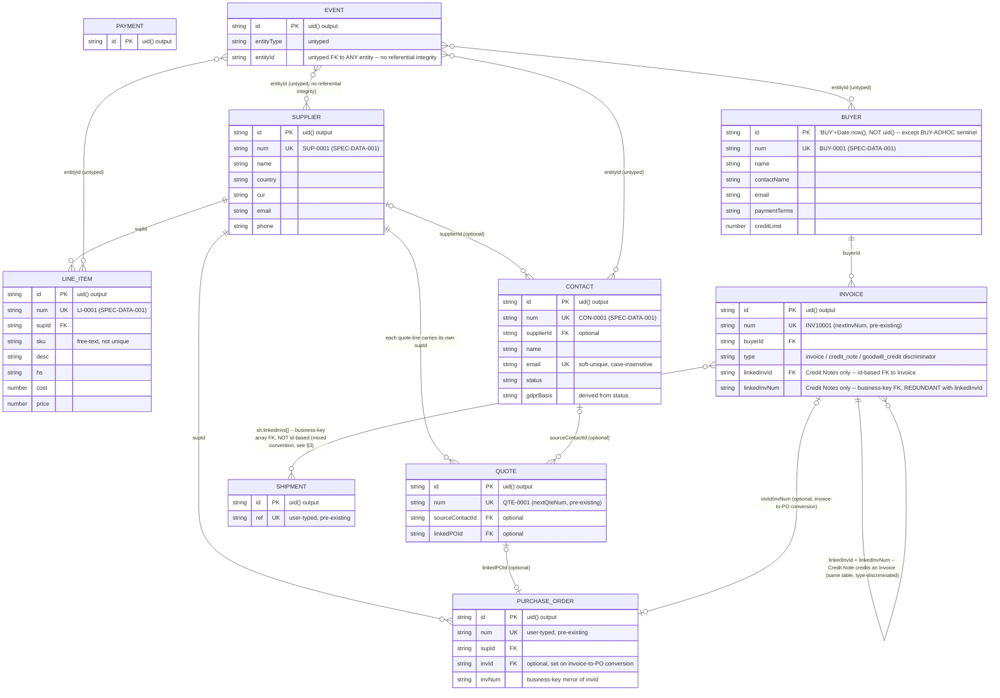

# Stackd Ops — Data Model

**Updated:** 2026-07-08 (SPEC-DATA-001 v1) — expanded from Contact↔Quote only to the full entity set.

---

## 1. Conceptual Model

Stackd Ops tracks a trade operation's core objects and how they connect:

- **Master data** — the reusable "who/what" records: **Suppliers**, **Buyers**, **Contacts**, **Line Items** (product catalogue)
- **Transactional documents** — the "what happened" records: **Quotes**, **Purchase Orders**, **Invoices**, **Credit Notes**, **Shipments**, **Payments**
- **Operational log** — **Events**, an append-only activity trail referencing any of the above loosely (by `entityType` + `entityId`, untyped)

Every master-data and transactional entity now has two identifiers, serving different purposes:

| Identifier | Purpose | Who sees it |
|---|---|---|
| **Primary Key (`id`)** | Internal linkage between records — how the app actually joins data | Never shown in the UI |
| **Business Key (`num` / `ref`)** | Human- and AI-referenceable identifier | Shown in every list, modal, and document |

Prior to SPEC-DATA-001, only transactional documents had a business key. Suppliers, Buyers, Contacts, and Line Items had none — this is now closed.

---

## 2. Logical Model — Entities, Keys, and Relationships

```
Supplier (DB.sup / K.s = 'st_s')
  id                PK — uid()
  num               Business key — 'SUP-0001' (SPEC-DATA-001)
  name, country, cur, ct, email, phone, notes

Line Item / Product Catalogue (DB.li / K.l = 'st_l')
  id                PK — uid()
  num               Business key — 'LI-0001' (SPEC-DATA-001)
  sku               Free-text, optional, NOT uniqueness-enforced — do not treat as a key
  supId             FK → Supplier.id
  desc, specs, hs, uom, cost, price, cur, notes, priceHistory[], invoiceRefs[], dims, dg

Buyer (DB.buy / K.bu = 'st_buy')
  id                PK — NOT uid() (corrected 2026-07-11, was wrongly stated as uid()
                       in early drafts of SPEC-DATA-001). saveBuy()/quickAddBuyer()
                       (index.html:4708, 4611) generate 'BUY' + Date.now() — a
                       BUY-prefixed decimal timestamp, e.g. 'BUY1720608432891'.
                       EXCEPT the seeded 'BUY-ADHOC' sentinel record, whose id is the
                       literal string 'BUY-ADHOC' (pre-existing special case,
                       unchanged by SPEC-DATA-001)
  num               Business key — 'BUY-0001' (SPEC-DATA-001); BUY-ADHOC also receives
                       one (e.g. 'BUY-0001') without its id changing
  name, contactName, email, phone, address, currency, paymentTerms, creditLimit, notes

Contact (DB.con / K.co = 'st_co')
  id                PK — uid()
  num               Business key — 'CON-0001' (SPEC-DATA-001)
  supplierId        FK → Supplier.id (optional, null if none; nulled on Supplier delete)
  name, email (soft-unique dedup key, case-insensitive), phone, company, status, source,
  gdprBasis (derived from status, not user-editable), createdAt, lastContactedAt, notes,
  enquiries[]       { id, ts, summary, source } — append-only

Quote (DB.qt / K.qt = 'st_qt')
  id                PK — uid()
  num               Business key — 'QTE-0001' (pre-existing, nextQteNum())
  sourceContactId   FK → Contact.id (optional, '' if none)
  linkedPOId        FK → PurchaseOrder.id (optional, '' if none)
  lineItems[]       each line carries its own supId → Supplier.id

Purchase Order (DB.po / K.p = 'st_p')
  id                PK — uid()
  num               Business key — user-typed (pre-existing), required, unique-validated
  supId             FK → Supplier.id
  invId, invNum     FK → Invoice.id / Invoice.num (both stored; set when a PO is raised
                       from an invoice's unlinked line items — see index.html:4117)

Invoice (DB.inv / K.i = 'st_i') — ALSO holds Credit Notes, discriminated by `type`
  id                PK — uid()
  num               Business key — 'INV10001' (pre-existing, nextInvNum()) or
                       'CN10001' for Credit Notes (same numbering space, CN-prefixed)
  buyerId           FK → Buyer.id
  type              'invoice' | 'credit_note' | 'goodwill_credit' — discriminator
  linkedInvId        [Credit Notes only] FK → Invoice.id (the invoice being credited)
  linkedInvNum       [Credit Notes only] FK → Invoice.num — REDUNDANT with linkedInvId,
                       both stored; see §3 note on mixed FK convention
  cnAmount, cnReason [Credit Notes only]

Payment (DB.payments / K.pm = 'st_pm')
  id                PK — uid()
  (no business key — not independently referenced elsewhere; tied to an invoice by
   application context, not a stored FK field)

Shipment (DB.sh / K.sh = 'st_sh')
  id                PK — uid()
  ref               Business key — user-typed (pre-existing), required, unique-validated
  linkedInvs[]       FK → Invoice.num — an ARRAY OF BUSINESS KEYS, not internal ids
                       (see §3 note)

Event (DB.events / K.ev = 'st_ev')
  id                PK — uid()
  entityType, entityId   Loose, untyped reference to any entity's id — not a real FK,
                           no referential integrity enforced
```

### Relationships (arrows read "references")

```
LineItem       ──(supId)──────────→ Supplier
Contact        ──(supplierId)─────→ Supplier          (optional)
Quote          ──(sourceContactId)→ Contact            (optional)
Quote          ──(linkedPOId)─────→ PurchaseOrder       (optional)
Quote.lineItem ──(supId)──────────→ Supplier            (per line)
PurchaseOrder  ──(supId)──────────→ Supplier
PurchaseOrder  ──(invId/invNum)───→ Invoice              (optional, set on invoice→PO conversion)
Invoice        ──(buyerId)────────→ Buyer
CreditNote     ──(linkedInvId)────→ Invoice              (id-based FK)
CreditNote     ──(linkedInvNum)───→ Invoice.num           (business-key FK, redundant with above)
Shipment       ──(linkedInvs[])───→ Invoice.num           (business-key FK, array)
Event          ──(entityId)───────→ * any entity (untyped, no referential integrity)
```

---

## 3. Known Inconsistency — Mixed FK Convention (not fixed by SPEC-DATA-001, noted for v3.0.0)

The codebase currently uses **two different conventions** for cross-entity references, predating SPEC-DATA-001:

- **Internal-ID-based FKs:** `supId`, `buyerId`, `sourceContactId`, `linkedPOId`, `linkedInvId` — reference the target's opaque `id`
- **Business-key-based FKs:** `linkedInvNum` (Credit Note → Invoice), `sh.linkedInvs[]` (Shipment → Invoice) — reference the target's human-facing `num`

Credit Notes even store **both** (`linkedInvId` and `linkedInvNum`) for the same relationship, redundantly.

This spec does not reconcile this — doing so would mean changing existing, working FK fields on live transactional data, which is a materially different (and riskier) class of change than the purely additive `num` field introduced here. It is recorded here so the decision is visible to whoever plans the v3.0.0 Supabase schema: a real relational database should pick one convention (canonically, foreign keys should reference the internal PK, now a Postgres UUID) and can migrate the business-key-based FKs to id-based ones as part of that cutover, once and cleanly, rather than patching it piecemeal on the localStorage stack under FM-1.

---

## 4. Physical Model — Storage

All entities persist as JSON arrays under a single `localStorage` key per entity (see `K` in `CLAUDE.md`), with no indexes, no foreign-key constraints, and no referential-integrity enforcement beyond what application code checks at write time (e.g. `delSup()` nulling `Contact.supplierId` before deleting a Supplier). This is unchanged by SPEC-DATA-001 and remains the case until the v3.0.0 Supabase migration introduces a real schema with enforced constraints.

| `DB` key | `localStorage` key (`K`) |
|---|---|
| `sup` | `st_s` |
| `li` | `st_l` |
| `buy` | `st_buy` |
| `con` | `st_co` |
| `qt` | `st_qt` |
| `po` | `st_p` |
| `inv` | `st_i` |
| `payments` | `st_pm` |
| `sh` | `st_sh` |
| `events` | `st_ev` |

---

## 5. Mermaid ERD (rendered diagram source)

Generated 2026-07-11 from §2's logical model. Renders in GitHub, GitLab, Obsidian, and any Mermaid-compatible viewer. `PK` = internal primary key, `UK` = business/unique key (where one exists), `FK` = foreign key.



**Reading notes:**
- `PAYMENT` has no drawn relationship — confirmed in §2, it carries no stored FK field; it's tied to an invoice only by application context (passed as a parameter at save time), not a persisted reference.
- The `INVOICE ||--o{ INVOICE` self-relationship is real, not a diagram error — Credit Notes are stored in the same `DB.inv` array as ordinary Invoices, discriminated by `type`, and reference the invoice they credit via both an `id`-based and a `num`-based field simultaneously (§3's redundancy note).
- `EVENT`'s relationships to other entities are drawn to four representative examples only (Supplier/Line Item/Buyer/Contact) — in reality `entityId` can reference *any* entity's `id`, untyped and unenforced, per §2.

## 6. Notes

- `sourceContactId` is set when a Quote is created via the "→ Quote" button on a Contact row.
- Deleting a Quote with a `sourceContactId` reverts the linked Contact from `converted` back to `qualified` (if it was `converted`).
- Deleting a Contact leaves dangling `sourceContactId` on associated Quotes — runtime guards no-op safely (CON-GAP-004).
- Contact `gdprBasis` is derived from `status` on every save, not user-editable.
- Deleting a Supplier nulls `supplierId` on all linked Contacts before the delete completes.
- **No Buyer record uses `uid()` for its `id`** (corrected 2026-07-11) — regular Buyers get `'BUY' + Date.now()` from `saveBuy()`/`quickAddBuyer()`; `BUY-ADHOC` is a seeded sentinel with the literal string `'BUY-ADHOC'` as its `id`. Buyers are the one entity in this data model whose internal PK is not a `uid()` output.
- See SPEC-DATA-001 §6 for the primary-key strategy designed to make the eventual v3.0.0 Supabase migration a simple surrogate-key swap rather than a from-scratch identifier redesign.
