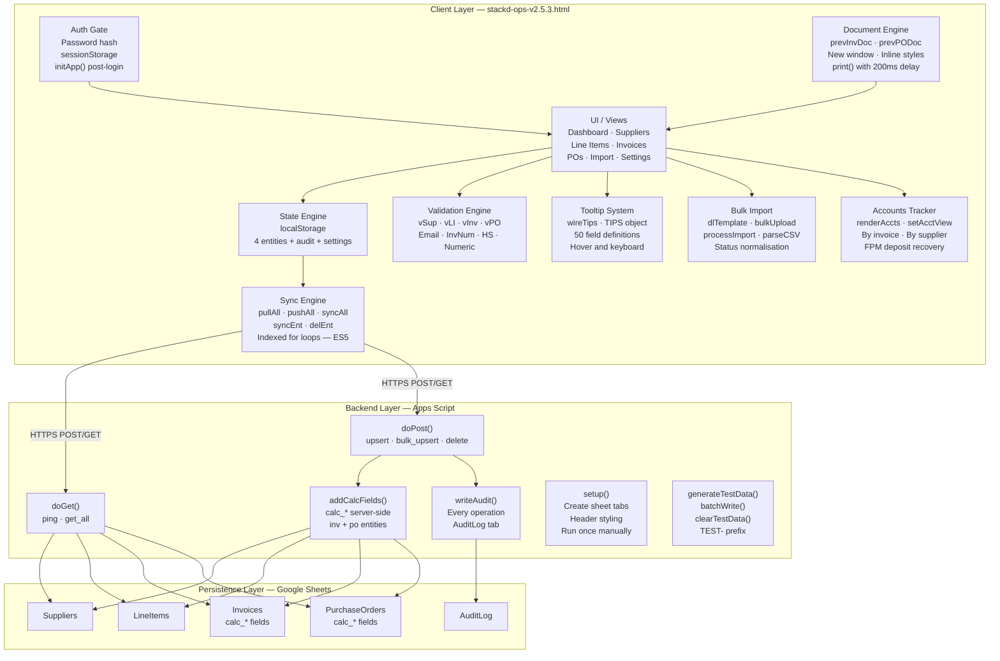
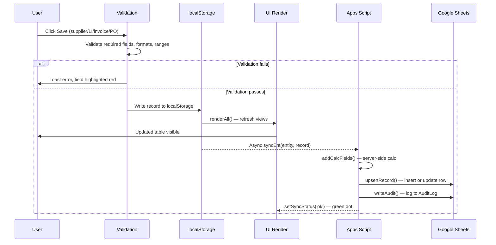
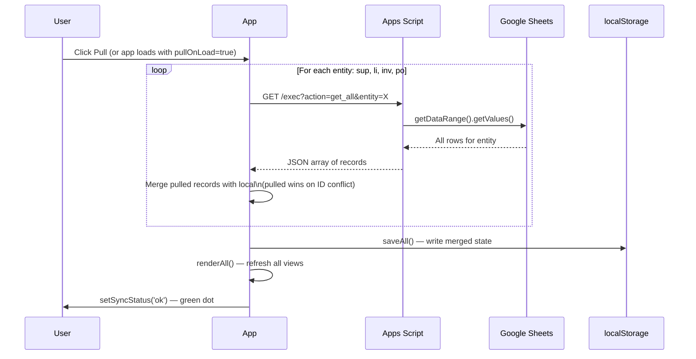
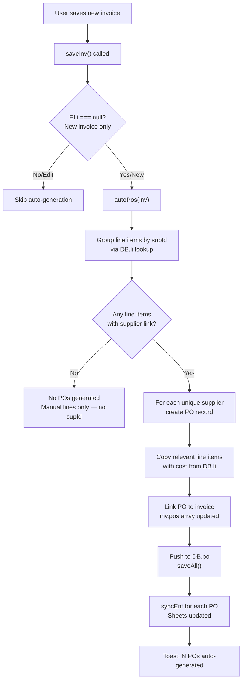
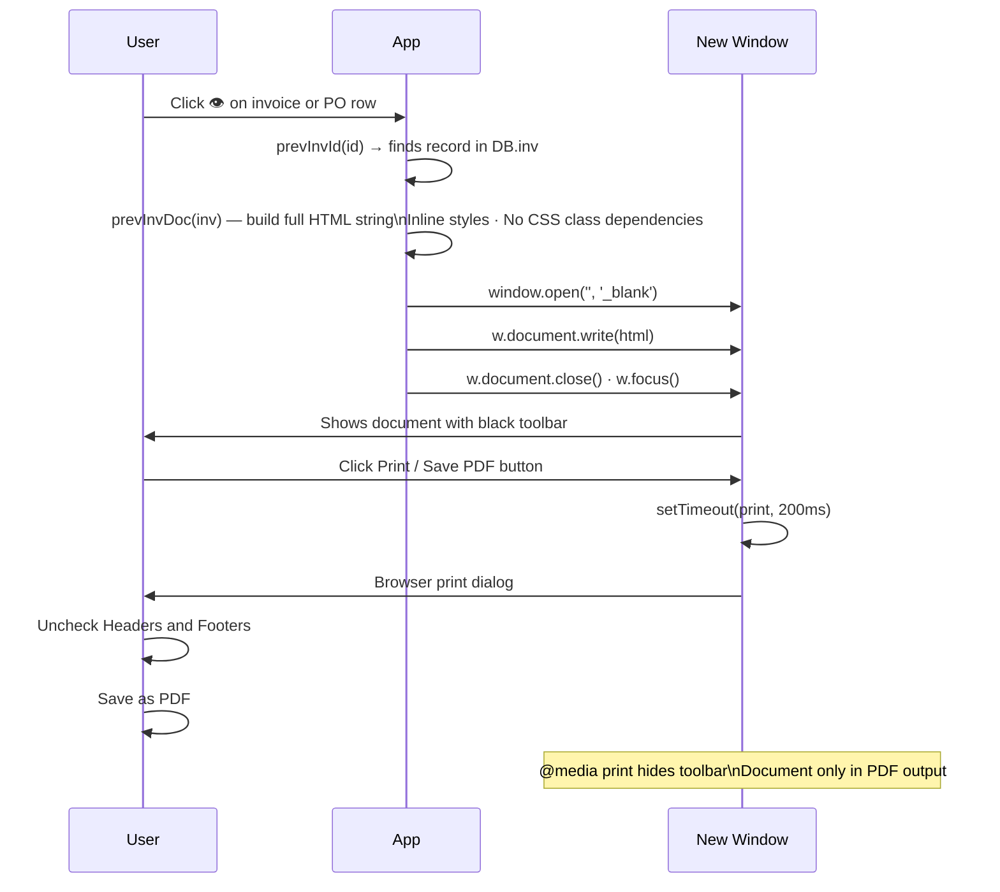
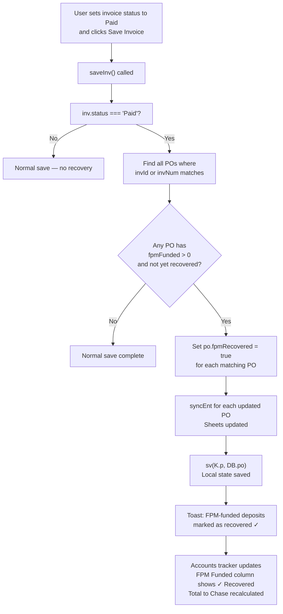
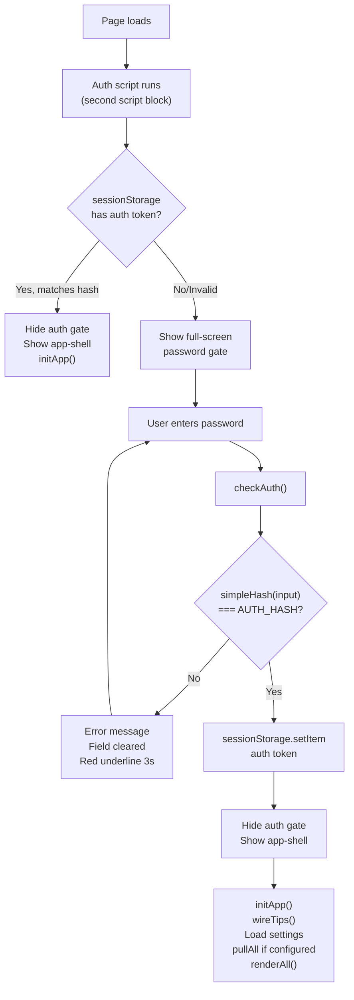
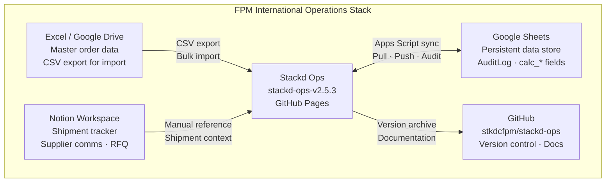

# Stackd Ops — System Architecture
**Version:** 1.1.0
**Date:** 2026-04-21
**Author:** FPM International
**Status:** Live — matches stackd-ops-v2.5.3
**Changes from v1.0.0:** Mermaid diagrams added throughout. Component architecture, data flows, save/pull/print/auto-PO sequences all in Mermaid. File inventory updated to v2.5.3. Security posture updated to reflect 2FA confirmed and GDPR filed.

---

## 1. System Overview

Stackd Ops is a single-page web application built as a self-contained HTML file. It operates as a lightweight operations platform for FPM International's procurement intermediary workflow. Operable in 15–60 minute time slots across multiple devices with no installation required.

**Design principles:**
1. Automation first — every manual step is a candidate for automation
2. Auditable and traceable — all state changes logged with timestamp
3. Future-proofed for TradeFlow SaaS — logic and data models documented for developer handoff
4. Designed for scale — sole trader today, team or product tomorrow
5. Seamless integration — minimal friction between tools

---

## 2. Component Architecture



---

## 3. Data Flows

### 3.1 Save Operation



### 3.2 Pull from Sheets



### 3.3 Invoice → PO Auto-Generation



### 3.4 Print Flow



### 3.5 FPM Deposit Recovery Flow



---

## 4. Authentication Flow



---

## 5. File Inventory

### Application
| File | Version | Purpose |
|------|---------|---------|
| `index.html` | Always current | Live app served by GitHub Pages |
| `app/stackd-ops-v2.5.3.html` | v2.5.3 | Versioned archive — FPM deposit tracker, accounts tracker, auto-recovery |
| `app/stackd-ops-v2.5.0.html` | v2.5.0 | Tooltips, dial codes, validation |
| `app/stackd-ops-v2.4.5.html` | v2.4.5 | Bulk import, HS codes, pro-forma |
| `app/stackd-ops-v2.3.2.html` | v2.3.2 | Password gate, print fix, GitHub Pages |

### Backend
| File | Version | Purpose |
|------|---------|---------|
| `backend/stackd-appsscript-v2.1.0.gs` | v2.1.0 | Complete Apps Script — CRUD, calc fields, audit log |
| `backend/stackd-testdata-v1.1.0.gs` | v1.1.0 | Test data generator — batchWrite, clearTestData |

### Documentation
| File | Version | Purpose |
|------|---------|---------|
| `docs/stackd-datamodel-v1.1.0.md` | v1.1.0 | Entity definitions, Mermaid ERD, status diagrams |
| `docs/stackd-architecture-v1.1.0.md` | v1.1.0 | This document — Mermaid component and flow diagrams |
| `docs/stackd-datastandards-v1.0.0.md` | v1.0.0 | Data quality rules, validation standards, glossary |
| `docs/stackd-regulatory-v1.0.0.md` | v1.0.0 | Legal and compliance — UK, Barbados, Nigeria, Ghana |
| `docs/stackd-userguide-v1.0.0.md` | v1.0.0 | Layperson operations manual — 8 workflows |
| `docs/stackd-quickref-v1.0.0.md` | v1.0.0 | One-page daily use card |
| `docs/stackd-qa-v1.1.0.md` | v1.1.0 | QA framework — 180+ test cases, full changelog |
| `docs/stackd-assessment-v1.0.2.md` | v1.0.2 | SDLC, data management, security, compliance scores |
| `docs/fpm-gdpr-statement-v1.0.0.md` | v1.0.0 | GDPR lawful basis statement — filed 2026-04-21 |

### Repository Structure
```
stackd-ops/
├── index.html                              ← live version (overwrite on release)
├── README.md
├── app/
│   ├── stackd-ops-v2.3.2.html
│   ├── stackd-ops-v2.4.5.html
│   ├── stackd-ops-v2.5.0.html
│   └── stackd-ops-v2.5.3.html
├── backend/
│   ├── stackd-appsscript-v2.1.0.gs
│   └── stackd-testdata-v1.1.0.gs
└── docs/
    ├── stackd-datamodel-v1.1.0.md
    ├── stackd-architecture-v1.1.0.md
    ├── stackd-datastandards-v1.0.0.md
    ├── stackd-regulatory-v1.0.0.md
    ├── stackd-userguide-v1.0.0.md
    ├── stackd-quickref-v1.0.0.md
    ├── stackd-qa-v1.1.0.md
    ├── stackd-assessment-v1.0.2.md
    └── fpm-gdpr-statement-v1.0.0.md
```

---

## 6. Versioning Convention

```
stackd-[component]-v[MAJOR].[MINOR].[PATCH].[ext]

MAJOR  Breaking rebuild or data model change
MINOR  New feature — backward compatible
PATCH  Bug fix or small change
```

**Commit message convention:**
```
v2.5.3 — FPM deposit tracker, auto-recovery on Paid
docs: datamodel v1.1.0 — Mermaid ERD, status diagrams
fix: net profit calculation for imported invoices
```

---

## 7. Integration Map



---

## 8. Performance Characteristics

| Metric | Current value | Notes |
|--------|--------------|-------|
| App load time | ~1–2 seconds | Google Fonts load async |
| Save operation | ~200ms local, 1–3s with sync | Sync is async, non-blocking |
| Pull from Sheets | 2–5 seconds | 4 sequential API calls |
| Push all to Sheets | 3–8 seconds | Depends on record count |
| Max practical records | ~500 per entity | localStorage ~5MB limit |
| Apps Script timeout | 6 minutes | Batch writes well within limit |
| generateTestData() | Under 10 seconds | batchWrite — single read + batch insert |

---

## 9. Security Posture

| Layer | Current (v2.5.3) | Target (v2.6.0) | Target (v3.0.0) |
|-------|-----------------|-----------------|-----------------|
| App access | Simple hash password gate | Apps Script secret token | OAuth2 / JWT |
| Google account | ✅ 2FA enabled | No change | No change |
| Data in transit | HTTPS (GitHub Pages + Google) | No change | No change |
| Data at rest | Google Sheets (Google security) | No change | Encrypt sensitive fields |
| Apps Script URL | Public endpoint — no auth | Secret token validation | Per-user auth |
| Source code | Public GitHub repo | No change | Private repo |
| Sensitive data | Bank details in localStorage plain text | No change | Web Crypto API encryption |
| GDPR | ✅ Lawful basis documented | Data export function | Full GDPR toolkit |
| Session | sessionStorage — tab-scoped | 8-hour timeout | JWT with expiry |
| XSS | No sanitisation on user input | HTML entity encoding | CSP header via Cloudflare |

---

## 10. Disaster Recovery

| Scenario | Recovery |
|----------|----------|
| Browser localStorage cleared | Pull from Sheets — full restore |
| Google Sheet accidentally deleted | Google Drive Trash — 30 day restore window |
| GitHub Pages URL changes | Update bookmark — data unaffected |
| Apps Script deployment broken | Redeploy from `/backend/` source — new URL, update Settings |
| index.html corrupted | Restore from `/app/` versioned archive |
| All Sheets data lost | No automated off-Sheets backup currently — scheduled backup planned v2.6.0 |

---

## 11. Version History

| Version | Date | Changes |
|---------|------|---------|
| v1.0.0 | 2026-04-21 | Initial architecture documentation |
| v1.1.0 | 2026-04-21 | Full Mermaid diagram suite added: component architecture, save/pull/print/auto-PO/FPM recovery sequence diagrams, auth flow, integration map. File inventory updated to v2.5.3. Security posture updated: 2FA confirmed, GDPR filed. |
