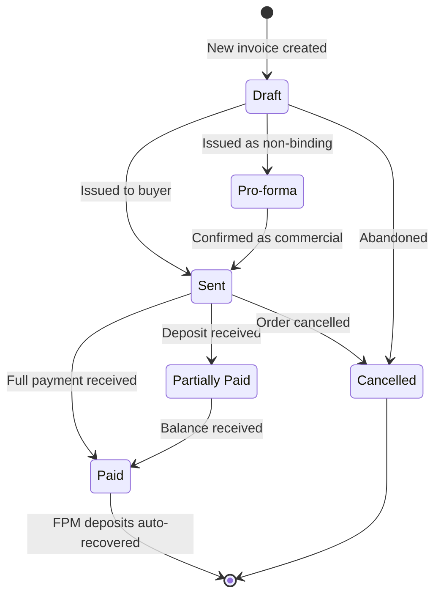
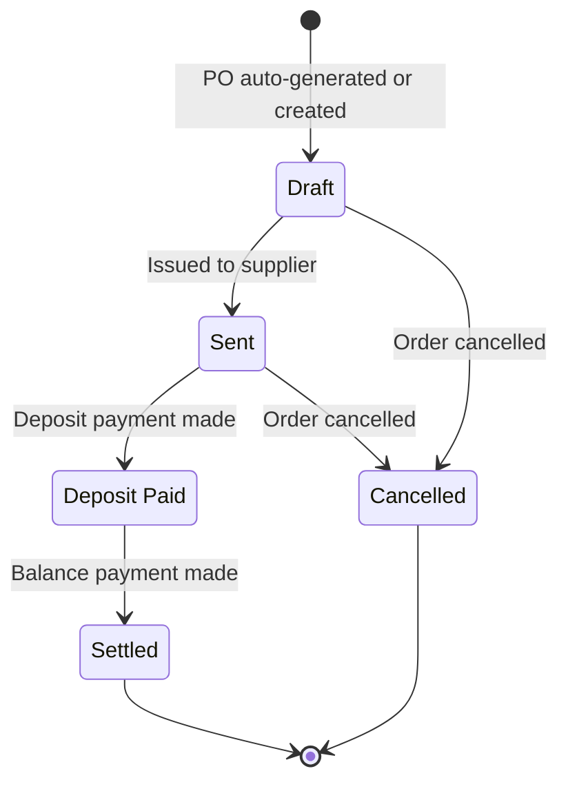
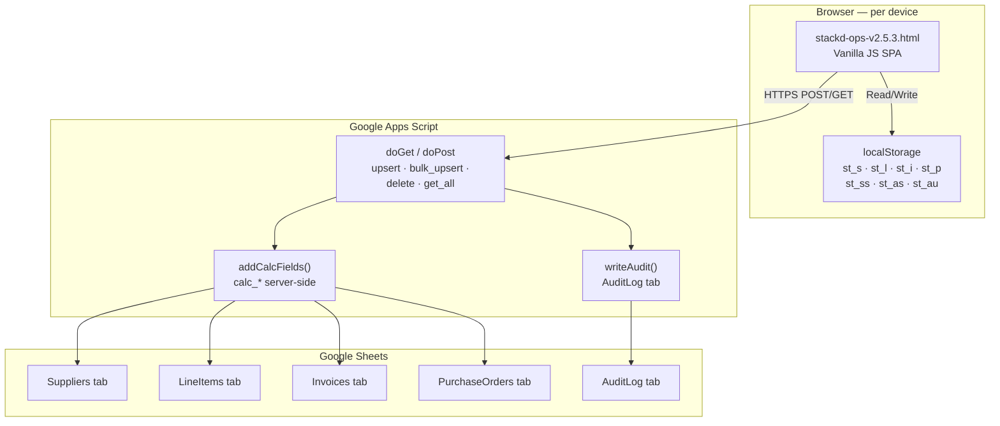
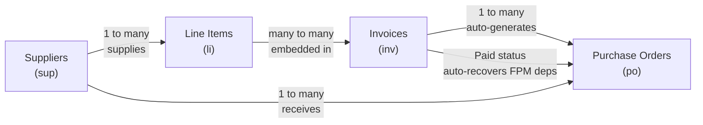

# Stackd Ops — Data Model
**Version:** 1.1.0
**Date:** 2026-04-21
**Author:** FPM International
**Status:** Live — matches stackd-ops-v2.5.3 and stackd-appsscript-v2.1.0.gs
**Changes from v1.0.0:** Mermaid ERD added. HS Code field added to Line Items. FPM Funded and fpmRecovered fields added to Purchase Orders. Items Subtotal noted on Invoices. Status state diagrams added.

---

## 1. Entity Relationship Diagram

```mermaid
erDiagram
    SUPPLIERS {
        string id PK
        string name
        string country
        string ct
        string email
        string phone
        string cur
        string notes
        datetime updAt
    }

    LINE_ITEMS {
        string id PK
        string sku
        string desc
        string specs
        string hs
        string supId FK
        string uom
        number cost
        number price
        string cur
        string notes
        datetime updAt
    }

    INVOICES {
        string id PK
        string num
        string buyer
        string buyerAddr
        string shipTo
        string dst
        string custId
        date date
        date expiry
        date shipDate
        string ft
        string wt
        string cbm
        string pk
        string pol
        string pod
        string coo
        string cur
        number taxRate
        number lf
        number ins
        number leg
        number isp
        number oth
        number dep
        string terms
        string status
        json lineItems
        json pos
        number calc_liTotal
        number calc_taxAmt
        number calc_grandTotal
        number calc_cogs
        number calc_grossProfit
        number calc_netProfit
        number calc_margin
        number calc_balanceDue
        datetime updAt
    }

    PURCHASE_ORDERS {
        string id PK
        string num
        string supId FK
        string invId FK
        string invNum
        date date
        date del
        string cur
        json lineItems
        number dep
        number fpmFunded
        boolean fpmRecovered
        number oth
        string notes
        string status
        datetime creAt
        datetime updAt
        number calc_liTotal
        number calc_grandTotal
        number calc_balanceDue
    }

    SUPPLIERS ||--o{ LINE_ITEMS : "supplies"
    SUPPLIERS ||--o{ PURCHASE_ORDERS : "receives"
    LINE_ITEMS }o--o{ INVOICES : "embedded in"
    INVOICES ||--o{ PURCHASE_ORDERS : "auto-generates"
```

---

## 2. Entity Overview

Stackd Ops uses four core entities. Every piece of operational data belongs to one of these entities. They are stored in browser localStorage (offline cache) and synced to Google Sheets via Apps Script (persistent store).

| Entity | Key | Sheet tab | Purpose |
|--------|-----|-----------|---------|
| Suppliers | `sup` | Suppliers | Master supplier list |
| Line Items | `li` | LineItems | Product catalogue |
| Invoices | `inv` | Invoices | Buyer-facing commercial documents |
| Purchase Orders | `po` | PurchaseOrders | Supplier-facing order documents |

---

## 3. Entity: Suppliers

**Purpose:** Master list of all companies FPM International sources from.

### Fields

| Field | Type | Required | Description |
|-------|------|----------|-------------|
| `id` | String | Yes | Unique identifier. Auto-generated. Format: `[timestamp36][random]`. Test records prefixed `TEST-`. |
| `name` | String | Yes | Supplier company name. Validated: non-empty. |
| `country` | String | No | Country of operation. Full name e.g. China, Barbados. |
| `ct` | String | No | Contact person name. |
| `email` | String | No | Supplier contact email. Validated: regex format check if provided. |
| `phone` | String | No | Stored as combined dial code + number e.g. `+86 531 8800 1234`. Dial code selected from ITU E.164 dropdown (250 countries). |
| `cur` | String | No | Preferred transaction currency. Enum: USD, CNY, GBP, EUR. Default: USD. |
| `notes` | String | No | Free text. Certifications, lead times, MOQs, due diligence findings. |
| `updAt` | ISO DateTime | Auto | Last updated timestamp. Set automatically on every save. |

### Business Rules
- Name is required — save blocked if empty.
- Email format validated on save — hard block if invalid.
- Deleting a supplier does not cascade-delete linked line items — `supId` reference retained, name shows as `?`.
- Supplier name used as matching key in bulk import — case-insensitive exact match.

---

## 4. Entity: Line Items

**Purpose:** Product catalogue. Each record represents one product from one supplier with cost and selling price.

### Fields

| Field | Type | Required | Description |
|-------|------|----------|-------------|
| `id` | String | Yes | Unique identifier. Auto-generated. |
| `sku` | String | No | Stock Keeping Unit. e.g. `REF-COMM-600L`. |
| `desc` | String | Yes | Product description. Validated: non-empty. |
| `specs` | String | No | Technical specifications. Size, grade, model, colour, voltage. |
| `hs` | String | No | HS (Harmonised System) code. Validated: numeric with optional decimal e.g. `8418.50`. Warn if invalid, allow save. |
| `supId` | String | Yes | Foreign key → Suppliers.id. Validated: must be selected. |
| `uom` | String | No | Unit of measure. e.g. pcs, kg, m², sheets. |
| `cost` | Number | No | Unit cost — what FPM pays the supplier. Validated: non-negative. |
| `price` | Number | No | Unit price — what FPM charges the buyer. Validated: non-negative. |
| `cur` | String | No | Currency. Enum: USD, GBP, EUR, BBD, NGN, GHS. |
| `notes` | String | No | Internal notes. HS codes, certifications, packaging. |
| `updAt` | ISO DateTime | Auto | Last updated timestamp. |

### Calculated (UI only — not stored)

| Calculation | Formula |
|-------------|---------|
| Unit margin | `price − cost` |
| Margin % | `(price − cost) / price × 100` |

### Business Rules
- Description and supplier are required.
- Cost and price must be non-negative.
- HS code validated as numeric — warning shown if non-numeric but save permitted.
- Line items are reusable across multiple invoices.
- Editing a line item's cost or price does not retroactively update existing invoices.

---

## 5. Entity: Invoices

**Purpose:** Buyer-facing commercial document. Groups line items into a single invoice for one buyer.

### Fields — Identity

| Field | Type | Required | Description |
|-------|------|----------|-------------|
| `id` | String | Yes | Unique identifier. Auto-generated. |
| `num` | String | Yes | Invoice number. Format: `INV#####` or `CN#####` (credit note) or `INV#####-D#` (draft). Validated: regex `^(INV\|CN)\d{4,6}(-D\d+)?$`. Uniqueness checked on save. |
| `buyer` | String | Yes | Buyer company or individual name. Validated: non-empty. |
| `buyerAddr` | String | No | Buyer full address. |
| `shipTo` | String | No | Delivery address if different from buyer address. |
| `dst` | String | No | Destination country. Used in dashboard charts. |
| `custId` | String | No | Customer reference ID. |
| `date` | Date | Yes | Invoice date. YYYY-MM-DD. |
| `expiry` | Date | No | Payment due date. |
| `shipDate` | Date | No | Estimated ship date. |
| `status` | Enum | Yes | Draft, Pro-forma, Sent, Partially Paid, Paid, Cancelled. |

### Fields — Shipping

| Field | Description |
|-------|-------------|
| `ft` | Freight type. e.g. Sea - FCL 40HQ. |
| `wt` | Estimated gross weight. e.g. 4200 KGS. |
| `cbm` | Estimated cubic volume. e.g. 22 CBM. |
| `pk` | Total packages. |
| `pol` | Port of Loading. e.g. Qingdao. |
| `pod` | Port of Discharge. e.g. Bridgetown. |
| `coo` | Country of Origin. e.g. China. |

### Fields — Financial

| Field | Type | Required | Description |
|-------|------|----------|-------------|
| `cur` | String | Yes | Invoice currency. Enum: USD, GBP, EUR, BBD, NGN, GHS. |
| `taxRate` | Number | Yes | Tax rate as decimal. e.g. 0.10 = 10%. Validated: 0 ≤ taxRate ≤ 1. |
| `lf` | Number | No | Local freight charge. Validated: non-negative. |
| `ins` | Number | No | Insurance charge. Validated: non-negative. |
| `leg` | Number | No | Legal / consular fees. Validated: non-negative. |
| `isp` | Number | No | Inspection / certification fees. Validated: non-negative. |
| `oth` | Number | No | Other charges. Validated: non-negative. |
| `dep` | Number | No | Buyer deposit received. Validated: non-negative. |
| `terms` | String | No | Terms of sale. Pre-filled from Settings default. |

### Embedded Line Item Sub-record

| Field | Type | Description |
|-------|------|-------------|
| `rid` | String | Row ID. Unique within this invoice. |
| `lid` | String | Reference to LineItems.id. Empty if added manually. |
| `desc` | String | Description as it appears on invoice. |
| `uom` | String | Unit of measure. |
| `qty` | Number | Quantity. |
| `up` | Number | Unit price charged to buyer. |

### Calculated Fields (written to Sheet by Apps Script)

| Field | Formula |
|-------|---------|
| `calc_liTotal` | Sum of `qty × up` across all line items |
| `calc_taxAmt` | `calc_liTotal × taxRate` |
| `calc_grandTotal` | `calc_liTotal + calc_taxAmt + lf + ins + leg + isp + oth` |
| `calc_cogs` | Sum of `qty × cost` looked up from LineItems |
| `calc_grossProfit` | `calc_liTotal − calc_cogs` |
| `calc_netProfit` | `calc_grandTotal − calc_cogs − lf − ins − leg − isp − oth` |
| `calc_margin` | `calc_netProfit / calc_grandTotal × 100` |
| `calc_balanceDue` | `calc_grandTotal − dep` |

### Business Rules
- Invoice number, buyer, date, and at least one line item are required.
- Invoice number format enforced: `INV#####`, `CN#####`, or `INV#####-D#`.
- Invoice number uniqueness checked against all existing invoices on save.
- Saving a new invoice triggers automatic PO generation — one PO per unique supplier.
- Tax applied to line items subtotal only — not to freight, insurance, or other charges.
- When status changes to `Paid` — all linked PO FPM-funded deposits are auto-recovered.
- `calc_*` fields are used as fallback for P&L when no live line items are loaded (e.g. imported invoices).

---

## 6. Entity: Purchase Orders

**Purpose:** Supplier-facing document. One PO per supplier per job.

### Fields

| Field | Type | Required | Description |
|-------|------|----------|-------------|
| `id` | String | Yes | Unique identifier. Auto-generated. |
| `num` | String | Yes | PO number. Auto-generated as `PO[invNum]-1`, `PO[invNum]-2` etc. Validated: non-empty. |
| `supId` | String | Yes | Foreign key → Suppliers.id. Validated: must be selected. |
| `invId` | String | No | Foreign key → Invoices.id. Empty for standalone POs. |
| `invNum` | String | No | Invoice number (denormalised for display). |
| `date` | Date | Yes | PO date. |
| `del` | Date | No | Required delivery date. |
| `cur` | String | Yes | PO currency. Enum: USD, CNY, GBP, EUR. |
| `lineItems` | JSON Array | Yes | PO line item sub-records. |
| `dep` | Number | No | Supplier deposit paid. Validated: non-negative. |
| `fpmFunded` | Number | No | Amount of deposit paid from FPM's own funds (not covered by buyer deposit). |
| `fpmRecovered` | Boolean | Auto | Set to `true` automatically when linked invoice is marked Paid. Read-only in UI. |
| `oth` | Number | No | Other charges. |
| `notes` | String | No | Special instructions to supplier. |
| `status` | Enum | Yes | Draft, Sent, Deposit Paid, Settled, Cancelled. |
| `creAt` | ISO DateTime | Auto | Created timestamp. Set on first save only. |
| `updAt` | ISO DateTime | Auto | Last updated timestamp. |

### PO Line Item Sub-record

| Field | Type | Description |
|-------|------|-------------|
| `rid` | String | Row ID. Unique within this PO. |
| `lid` | String | Reference to LineItems.id. |
| `desc` | String | Product description. |
| `sku` | String | SKU from line item record. |
| `uom` | String | Unit of measure. |
| `qty` | Number | Quantity ordered. |
| `cost` | Number | Unit cost paid to supplier. |

### Calculated Fields (written to Sheet)

| Field | Formula |
|-------|---------|
| `calc_liTotal` | Sum of `qty × cost` |
| `calc_grandTotal` | `calc_liTotal + oth` |
| `calc_balanceDue` | `calc_grandTotal − dep` |

### Business Rules
- PO number and supplier are required.
- Auto-generated POs inherit line items from parent invoice, mapped to their suppliers.
- `fpmFunded` records operator-funded deposit amounts — tracked separately from buyer-funded amounts.
- `fpmRecovered` is system-controlled only — set automatically when invoice marked Paid. Cannot be manually edited.
- Status `Settled` excludes PO from dashboard PO commitment totals and accounts tracker balances.

---

## 7. Invoice Status State Diagram



---

## 8. Purchase Order Status State Diagram



---

## 9. Data Storage Architecture



---

## 10. Entity Relationships — Summary



---

## 11. ID Convention

All IDs are auto-generated:
```javascript
Date.now().toString(36) + Math.random().toString(36).slice(2,5)
```
Produces a short, unique, time-ordered string e.g. `lf3k2abc`.
Test data IDs use the prefix `TEST-` e.g. `TEST-SUP-001`.

---

## 12. TradeFlow Scaling Notes

| Current design | TradeFlow change required |
|----------------|--------------------------|
| localStorage as offline cache | IndexedDB or service worker cache |
| Single Google Sheet per user | Multi-tenant PostgreSQL or Firestore |
| Apps Script as backend | REST API (Node.js/Express or FastAPI) |
| Simple hash password gate | OAuth2 / JWT per user |
| Single currency per invoice | Multi-currency with FX rate storage |
| Manual invoice numbering | Auto-incrementing sequence per organisation |
| Embedded line items in invoice row | Normalised line_items table with foreign key |
| No role-based access | Admin / operator / read-only roles |
| Audit log capped at 500 local entries | Unlimited audit log with search |
| fpmFunded as PO field | Ledger-style transactions table |

---

## 13. Version History

| Version | Date | Changes |
|---------|------|---------|
| v1.0.0 | 2026-04-21 | Initial data model documentation |
| v1.1.0 | 2026-04-21 | Mermaid ERD added. HS Code field added. fpmFunded and fpmRecovered fields added to POs. Items Subtotal noted. Status state diagrams for Invoice and PO. Storage architecture flowchart. Entity relationship flowchart. Invoice number format updated to INV#####. |
